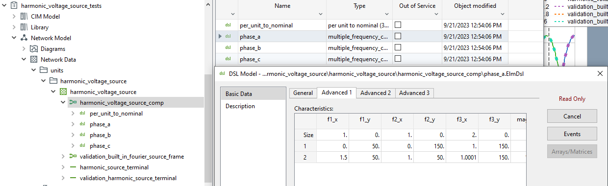

# Harmonic Voltage Source Model

- Type of simulation: EMT
- Software: PowerFactory (DSL)

Developed for the publication (**please cite**)

*Open-Source EMT Model of Grid-Forming Converter with Industrial Grade SelfSync and SelfLim Control* by Simon Eberlein, Peter Unruh and Tobias Erckrath, IEEE ISGT 2023, Grenoble.

See also *github.com/FraunhIEE-UniKassel-PowSysStability/paper_isgt_2023_selfsync*.

Used for the test system according to
"FNN Guideline: Grid forming behaviour of HVDC systems and DC-connected 
PPMs." VDE Verband der Elektrotechnik Elektronik Informationstechnik, 2020.
## Description

Up to three sinusoidal signals can be superimposed. The signals can vary during the simulations (i.e. their frequency, magnitude, angle, offset), this is not possbible with the built-in ElmFsrc of PowerFactory. 

The model is found in the *harmonic_voltage_source_tests* project under 

*Network Model\Network Data\units\harmonic_voltage_source\harmonic_voltage_source\harmonic_voltage_source_comp*

or the template under

*Library\Templates\units\harmonic_voltage_source\harmonic_voltage_source*

The settings are found on the advanced tab of the DSL model:
 

To understand the settings, please have a look at the python file harmonic_voltage_source.py (which also provides a Python interface to the model).
The unit tests in test_harmonic_voltage_source.py provide some examples.

